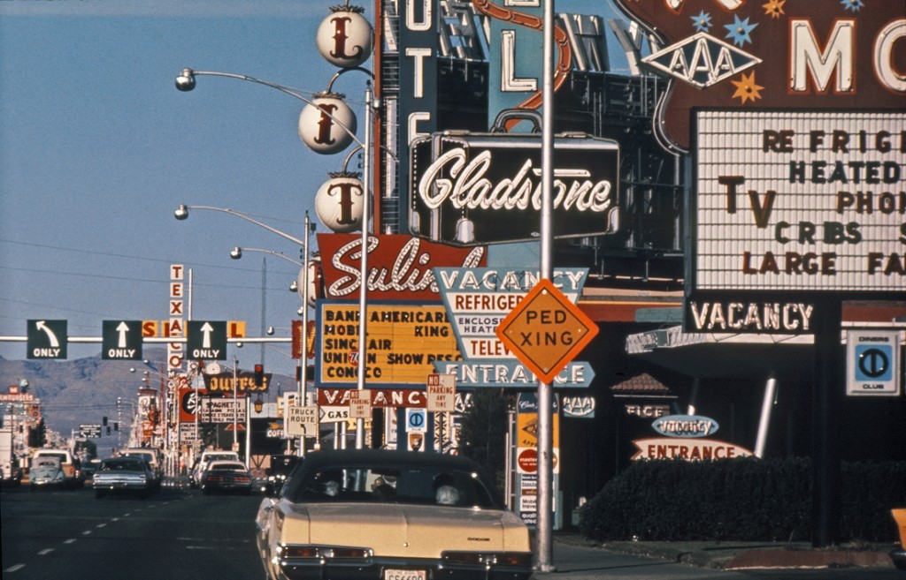
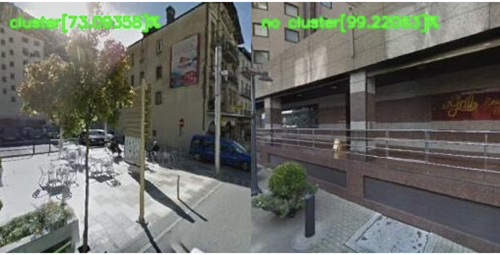
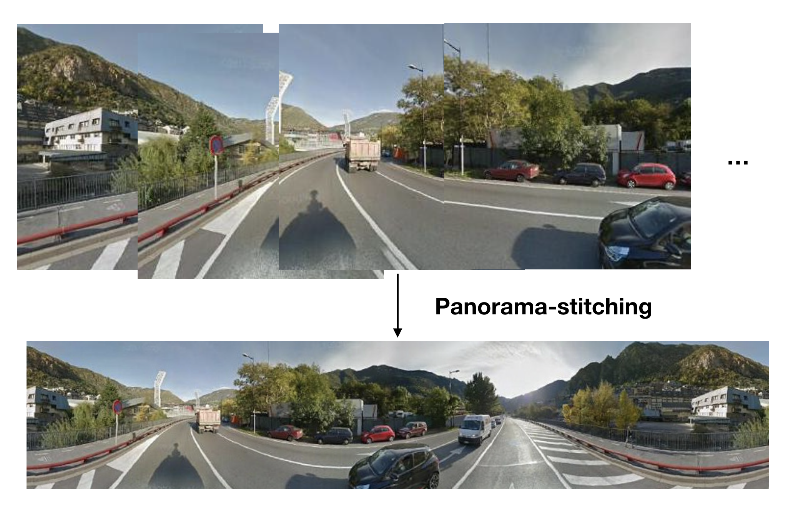
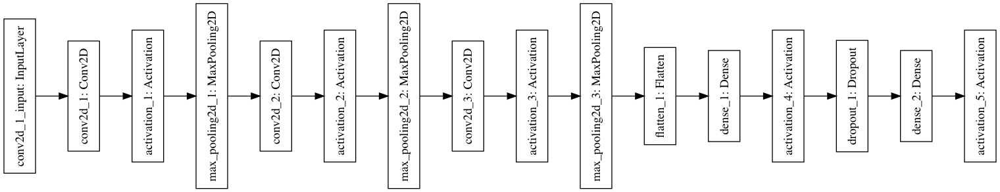

# Deep Image Of The City

With a combination of telecom data and image data, we build a data-driven model of certain human dynamics.

## Outlines

1. Telecom Dances + Computer Vision: From Location-Based-Service(LBS) Data To Google-Street-View(GSV)
2. Building DL Model for predicting Clusters vs Non-clusters
3. Using Class Activation Map (CAM) to find visual features associated with clusters

## Dataset Building

Code in `GSVScraper/`

### 1. The Andorra Data Package

Data includs telecom data collected in Andorra, the format is listed in the `Sample Json/` :

- "C" means the cluster information we defined through "Stay Event"
- "UnC" are some random information of places we did not defined to be cluster
- "Timestamp" is the time we collected the data in a format of epoch time
- We also have the information of things like coordinates of the users which is the key part in our project

### 2. Extract the coordinates

Extract the locations we want, codes in extract_cluster.py and extract_no_cluster.py:

- The time that has the largest number of "cluster": 09/15/2016 @ 10:35am (UTC), at that time there exists 31 "clusters" accoding to our telecom data
- We extract the coordinates (the script can avoid the repeated data) with around 1500 "cluster" locations and 5000 "non-cluster" locations, sample Json document is like the testLocations.json
- Call the gmplot library to plot the heat-map of those cluster coordinates so we could visualize the places we collect the GSV images.

(1)cluster-heatmap of Andorra

(2)detailed map: blue markers are cluster locations while yellow are non-clusters

### 3. Google Street View Building

In code GSVScraper.py, through the GSV Api we could obtain the street view images of the locations we collected in Step2. The script has automatically detract the "indoor" images and does some basic image preprocessing jobs as soon as we download the GSV images.

Images are labelled into "cluster" or "non-cluster" images and then are used for training a supervised binary classification model.

Through our tests on a very simple Convoultional Neural Network, we found the images in certain angle may not be so accurate for an image may face directly to a wall but the rear area might be a square that easily forms a cluster. So we decide to build a panorama image-dataset instead.

Sample Prediction Results: the right one is reason for us to use the panorama images:

To change images from different angles of a camera to a single panorama image, we could use some OpenCV script or use some professional software like PtGUI which is good in batch processing. We are still working on this and trying to find the perfect results.

Panorama image stitching:

## Data-driven Model Building

Codes in DL_Model/

A simple CNN model:

Some Class Activation Map (CAM) results of scenes predicted to be "cluster":

